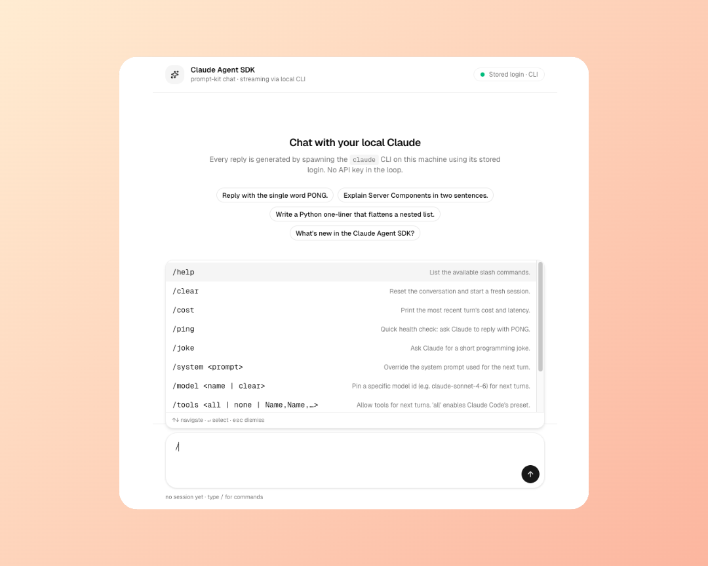

# agent-sdk-demo

A small chat playground built on top of the [Claude Agent SDK for Python](https://github.com/anthropics/claude-agent-sdk-python). Streams responses from a locally-spawned `claude` CLI, exposes them through SSE to a Next.js + [prompt-kit](https://www.prompt-kit.com) UI, and lets you drive tools, system prompts and permissions via slash commands.



```
┌────────────┐     SSE      ┌────────────┐     spawn     ┌──────────┐
│  Next.js   │ ───────────▶ │  FastAPI   │ ────────────▶ │ claude   │
│  (web/)    │   /api/chat  │  (server/) │  Agent SDK    │   CLI    │
└────────────┘              └────────────┘               └──────────┘
```

## Why this exists

- Verify the Python Agent SDK end-to-end with a real UI.
- Authenticate **only** with the local CLI's stored login (`claude /login`); the backend strips token env vars before spawning.
- Show off prompt-kit components in a polished chat layout.

## Quick start

```bash
# 1. Backend
uv sync
uv run uvicorn server.main:app --host 127.0.0.1 --port 8000

# 2. Frontend (in another shell)
cd web
npm install
npm run dev
# open http://localhost:3000
```

You need an existing `claude` CLI login on this machine. If you don't have one, run `claude /login` once.

Smoke-test with no UI:

```bash
uv run python demo.py
```

## Slash commands

Type `/` in the composer to open a typeahead.

| Command | Effect |
| --- | --- |
| `/help` | List all commands |
| `/clear` | Reset conversation + session |
| `/cost` | Last turn's cost / latency |
| `/ping` | Quick `PONG` round-trip |
| `/joke` | Ask Claude for a programming joke |
| `/system <prompt>` | Override the system prompt for next turns |
| `/model <id\|clear>` | Pin a model (e.g. `claude-sonnet-4-6`) |
| `/tools <all\|none\|demo\|Name,Name>` | Enable tools. `demo` exposes the in-process SDK MCP tools (`roll_dice`, `flip_coin`, `now`) defined in `server/sdk_tools.py` |
| `/deny <Name,Name\|none>` | Deny-list specific tools |
| `/permissions <default\|bypass\|plan\|acceptEdits>` | Set the SDK permission mode |

When tools are enabled, each call surfaces an Allow / Deny card inline before running, and the card shows the tool's elapsed time once it completes (captured by a `PostToolUse` hook). Implementation note on permissions: the Allow/Deny flow works thanks to a `PreToolUse` hook returning `permissionDecision: "ask"` — see [SDK issue #469](https://github.com/anthropics/claude-agent-sdk-python/issues/469).

## Layout

```
agent_auth.py             scrubs token env vars (default) or passes them through (AUTH_MODE=token)
demo.py                   minimal SDK round-trip script
server/main.py            FastAPI SSE + permission queue + Pre/PostToolUse hooks
server/sdk_tools.py       in-process MCP server (`@tool`-decorated Python functions)
web/src/app/              Next.js app router page
web/src/components/chat/  header, empty-state, bubble, composer, slash-menu, tool-call card
web/src/lib/              useChat hook, SSE client, slash-command registry
docs/                     deployment guide
```

## Deploy

See [`docs/deployment-railway.md`](docs/deployment-railway.md) — Dockerfiles + `.dockerignore` are committed; `AUTH_MODE`, `CLAUDE_CODE_OAUTH_TOKEN`, `ALLOW_ORIGINS` and `NEXT_PUBLIC_BACKEND_URL` are the four env vars you need.

## Stack

- **Backend** Python 3.13 · FastAPI · sse-starlette · `claude-agent-sdk`
- **Frontend** Next.js 16 · React 19 · Tailwind v4 · shadcn/ui · prompt-kit
- **Tooling** uv · Geist font
